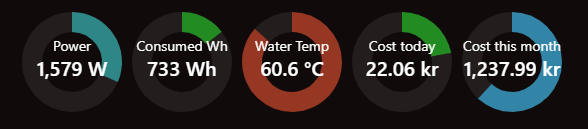

# MMM-MultiGauge



MMM-MultiGauge is a flexible gauge dashboard for MagicMirror². It renders multiple independent donut gauges with Chart.js and supports MQTT or HTTP API sources, optional secondary text, threshold-based coloring, and configurable glow states.

## Features

- Multiple gauges in horizontal, vertical, or grid layouts
- Smooth low/mid/high color interpolation with configurable thresholds
- MQTT and HTTP API sources, each with optional secondary values
- Per-gauge labels, postfixes, min/max ranges, multipliers, and offsets
- Glow alerts for over-max, below-min, boolean, or named external states
- Lightweight Chart.js v4 rendering with a maintained, linted codebase

## Requirements

- MagicMirror² (v2.24+ recommended)
- Node.js 18 or newer

## Installation

```bash
cd ~/MagicMirror/modules
git clone https://github.com/late4marshmellow/MMM-MultiGauge.git
cd MMM-MultiGauge
npm install
```

## Quick start

Add to your `config/config.js`:

```javascript
{
  module: "MMM-MultiGauge",
  position: "bottom_center",
  config: {
    layout: "horizontal", // "horizontal" | "vertical" | "grid"
    spacing: 10,
    columns: 2, // used only in grid layout

    // Global (fallback) options
    startDeg: 0,
    sweepDeg: 360,
    cutout: "60%",
    animationDuration: 250,
    colorBackground: "#ffffff14",
    textColor: "#fff",
    textColorOverMax: "#ff5a5a",
    textColorBelowMin: "#3b82f6",
    glowOverMax: true,
    glowBelowMin: false,
    glowBoolean: false,
    glowStates: null, // optional object map for named states
    glowTarget: "card", // "card" | "text" | "donut"
    glowColor: "rgba(255, 0, 0, 0.6)", // legacy fallback
    glowColorOverMax: "rgba(255, 0, 0, 0.6)",
    glowColorBelowMin: "rgba(59, 130, 246, 0.6)",
    glowColorBoolean: "rgba(255, 165, 0, 0.6)",
    glowIntensity: "0 0 10px",

    // MQTT broker (optional)
    mqtt: {
      url: "mqtt://127.0.0.1:1883",
      username: "",
      password: "",
      clientId: "",
      qos: 0,
      insecureTLS: false
    },

    // HTTP API (optional)
    api: {
      method: "GET",
      tokenType: "Bearer",
      token: "",
      headers: {},
      insecureTLS: false
    },

    // Preferred shared auth for API polling and Homey discovery
    token: "",
    tokenType: "Bearer",

    updateInterval: 30 * 1000,
    verbose: false,

    gauges: [
      {
        id: "gauge1",
        label: "Power",
        labelSize: 14,
        labelColor: null,
        postfix: "W",
        maxValue: 5000,
        minValue: null,
        colorLow: "#228B22",
        colorMid: "#3b82f6",
        colorHigh: "#B22222",
        colorLowValue: 750,
        colorMidValue: 2500,
        colorHighValue: 4250,
        multiplier: 1,
        offset: 0,
        secondaryTextPrefix: "Mode: ",
        secondaryTextSize: 12,
        secondaryTextColor: null,
        secondaryTextPostfix: "",

        // Source 1: MQTT value
        mqtt: {
          topic: "home/power/active", // plain or JSON
          parser: "json", // "plain" | "json"
          valuePath: "value" // used when parser is json
        },

        // Optional: MQTT boolean or named state for glow
        mqtt_boolean: {
          topic: "home/power/warning",
          parser: "plain", // or json
          valuePath: "value"
        },

        // Optional: MQTT secondary text/value shown below the main value
        mqtt_secondary: {
          topic: "home/power/mode",
          parser: "plain",
          valuePath: "value"
        },

        // Optional: state-specific glow map when mqtt_boolean sends strings
        glowStates: {
          warning: { color: "rgba(255, 165, 0, 0.6)" },
          critical: { color: "rgba(255, 0, 0, 0.7)", textColor: "#ff5a5a" },
          normal: { color: null }
        },

        // Or Source 2: HTTP API (instead of MQTT)
        // api: { baseUrl: "https://example/api/", path: "status", valuePath: "data.power" }
        // api_secondary: { baseUrl: "https://example/api/", path: "status", valuePath: "data.mode" }
      }
    ]
  }
}
```

## Homey integration (discover topics)

This module works great with Homey. The most reliable path is: run the official Homey MQTT Broker, then publish device values to topics and point MMM-MultiGauge to those topics.

### 1. Install the official MQTT Server on Homey

- Install: https://homey.app/en-no/app/net.weejewel.mqttserver/MQTT-Server/
- Open the app on Homey and note the broker IP/port and if set, username/password.

### 2. Connect MagicMirror to Homey's broker

In your MMM-MultiGauge `config.js`, set:

```javascript
mqtt: {
  url: "mqtt://<HOMEY_IP>:1883",
  username: "<if-configured>",
  password: "<if-configured>",
  clientId: "mmm-multigauge",
  qos: 0,
  insecureTLS: false
}
```

### 3. Discover Homey devices and topics

The module includes a helper tool that discovers Homey devices and generates ready-to-use MQTT topic paths.

**First-time setup:**

```bash
cd ~/MagicMirror/modules/MMM-MultiGauge
cp tools/discover-homey-devices.js.sample tools/discover-homey-devices.js
```

You can either edit the manual values at the top of `tools/discover-homey-devices.js` or let the tool auto-load the Homey IP and token from your MMM-MultiGauge config.

Recommended module config for auto-discovery:

```javascript
config: {
  token: "your-homey-token",
  tokenType: "Bearer",
  mqtt: {
    url: "mqtt://192.168.1.50:1883"
  }
}
```

**Run the discovery tool:**

```bash
node tools/discover-homey-devices.js
# or with filters:
node tools/discover-homey-devices.js power              # devices with "power" in name
node tools/discover-homey-devices.js "" measure_power   # devices with measure_power capability
node tools/discover-homey-devices.js --ip 192.168.1.50 --token YOUR_TOKEN power
```

The discovery tool queries your local Homey HTTP API and lists:

- Device names and IDs
- Available capabilities (measure_power, measure_temperature, etc.)
- Full MQTT topic path suggestions ready to copy into your config
- Inline JSON gauge snippets for faster copy/paste into `config.js`

**Note:** The configured `discover-homey-devices.js` file is gitignored to help keep your API token out of commits.

### 4. Understanding Homey topic structure

Homey MQTT topics follow this pattern:

```
homey/devices/<DEVICE_ID>/capabilities/<CAPABILITY_NAME>/value
```

**Example topic:**

```
homey/devices/a3f8e2c1-9b4d-4a7e-8f3c-d5e9b2a1c6f4/capabilities/measure_power/value
```

Where:

- `a3f8e2c1-9b4d-4a7e-8f3c-d5e9b2a1c6f4` = unique device ID (UUID format)
- `measure_power` = capability name (also: `measure_temperature`, `onoff`, `meter_power`, etc.)

**Common capabilities:**

- `measure_power` - Current power consumption (W)
- `measure_temperature` - Temperature sensor (°C)
- `meter_power` - Total energy consumption (kWh)
- `onoff` - Boolean on/off state
- `alarm_contact` - Door/window sensor
- `dim` - Dimmer level (0-1)

### 5. Configure gauges with Homey topics

```javascript
gauges: [
  {
    id: "living_room_power",
    label: "Power",
    postfix: "W",
    maxValue: 3000,
    mqtt: {
      topic:
        "homey/devices/a3f8e2c1-9b4d-4a7e-8f3c-d5e9b2a1c6f4/capabilities/measure_power/value",
      parser: "plain"
    }
  },
  {
    id: "boiler_temp",
    label: "Boiler",
    postfix: "°C",
    maxValue: 70,
    minValue: 40,
    mqtt: {
      topic:
        "homey/devices/b7c2d8e3-1f5a-4c9e-a2d6-e8f3b9c1d4a7/capabilities/measure_temperature/value",
      parser: "plain"
    },
    mqtt_boolean: {
      topic:
        "homey/devices/b7c2d8e3-1f5a-4c9e-a2d6-e8f3b9c1d4a7/capabilities/onoff/value",
      parser: "plain"
    }
  }
];
```

### Alternative: simplified topics via Flows

If you prefer shorter topic names, create Homey Flows to republish values:

**Flow example:**

- **When**: Device capability changed (e.g., power meter updates)
- **Then**: Publish MQTT message to `homey/power/living_room` with value

This gives you shorter, easier-to-read topics:

```javascript
mqtt: {
  topic: "homey/power/living_room",
  parser: "plain"
}
```

### Tips

- Use MQTT Explorer to browse your Homey broker and inspect live payloads.
- Run the discovery tool after copying and configuring `tools/discover-homey-devices.js.sample` to get exact topic paths.
- With MQTT Hub-style apps, topics usually auto-publish; with Flows, you control the topic names.

## Advanced options (per gauge)

- Color thresholds: `colorLow`, `colorMid`, `colorHigh` and their value anchors `colorLowValue`, `colorMidValue`, `colorHighValue`
- Min/max: `minValue`, `maxValue` for range checks and text feedback
- Value transforms: `multiplier`, `offset` for unit conversions or offsets
- Labels: `label`, `labelSize`, `labelColor`
- Secondary text: `secondaryTextPrefix`, `secondaryTextSize`, `secondaryTextColor`, `secondaryTextPostfix`
- Secondary sources: `mqtt_secondary` and `api_secondary`
- Glow controls: `glowOverMax`, `glowBelowMin`, `glowBoolean`, `glowStates`, `glowTarget`, `glowColor`, `glowColorOverMax`, `glowColorBelowMin`, `glowColorBoolean`, `glowIntensity`
- Shared API auth: top-level `token` and `tokenType` override nested `api.token` and `api.tokenType`

## Styling

You can further customize the presentation through `MMM-MultiGauge.css` or your global custom CSS.

## Troubleshooting

- Gauge shows “Waiting...” : verify that your data source is configured and actively publishing.
- No MQTT updates: confirm broker URL and credentials, and verify that the topic is populated with MQTT Explorer. Check MagicMirror logs as well.
- JSON parsing errors: ensure `parser` matches the payload format and `valuePath` points to the correct property.
- Secondary text not updating: confirm `mqtt_secondary` or `api_secondary` is configured and that the returned value is a string or number.
- State glow not triggering: check that `mqtt_boolean` publishes the exact string keys used in `glowStates`.
- Colors look off: adjust the `color*Value` anchors or set explicit `colorLow`, `colorMid`, and `colorHigh` values.

## Contributing

Please read `CODE_OF_CONDUCT.md` before contributing. PRs and issues are welcome.

## License

MIT — see `LICENSE`.
